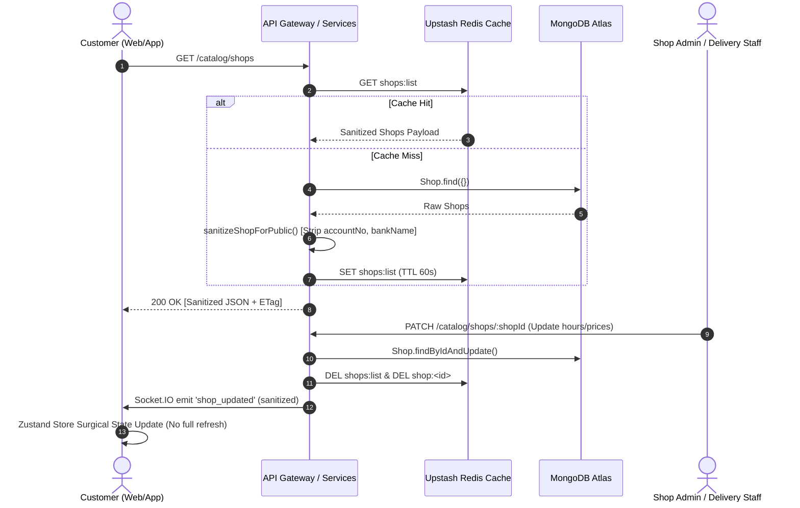
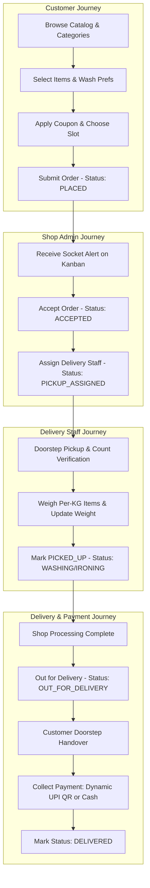
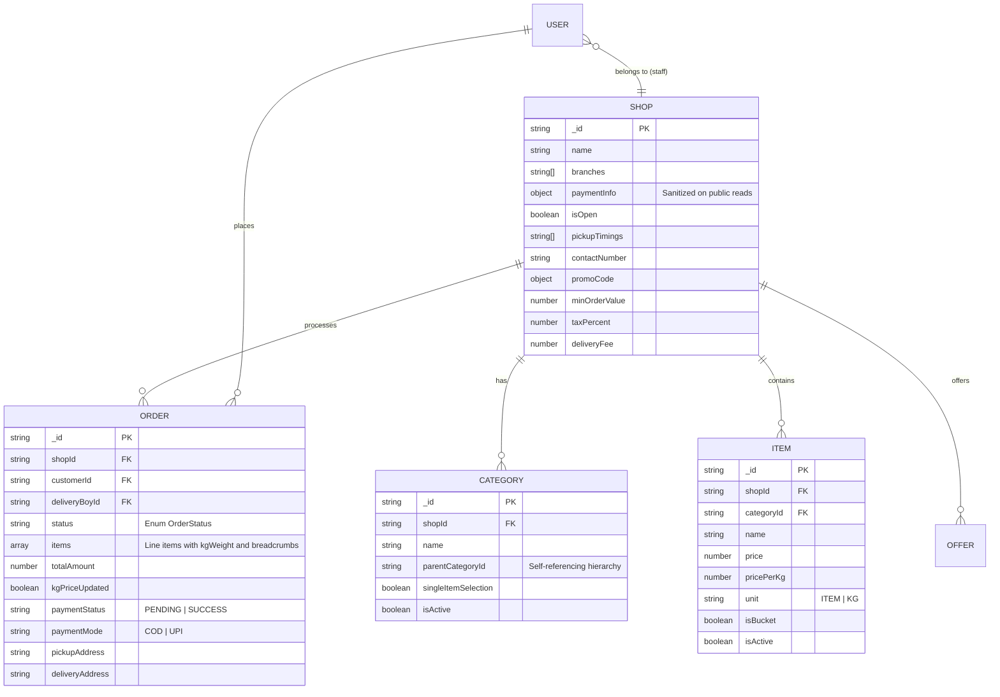
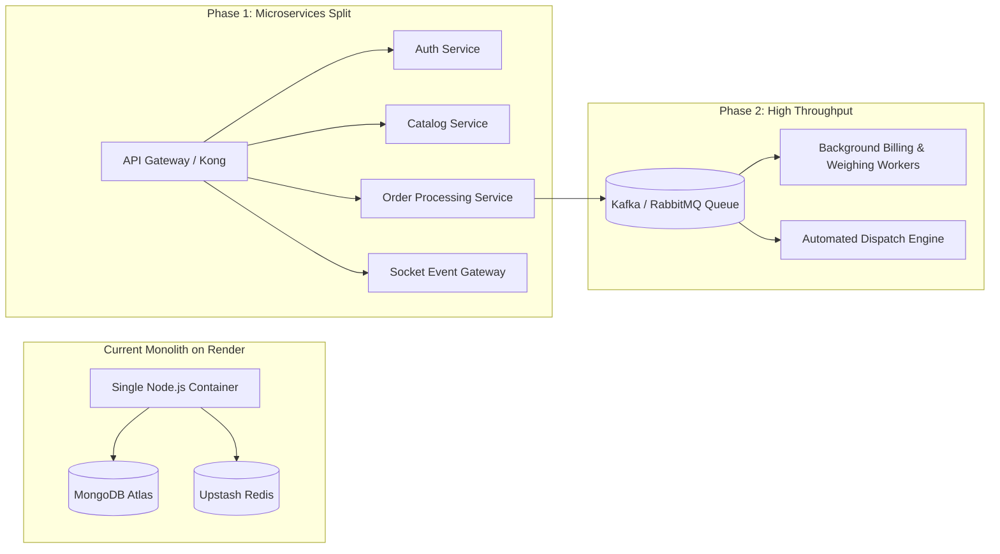

# WOW Laundry — Master Software Architecture & System Knowledge Base

> **Version:** 2.0.0  
> **Last Updated:** September 2026  
> **Target Audience:** Engineering Team, System Architects, DevOps, and AI Context Primers  
> **Scope:** Full-stack microservices architecture, cross-platform synchronization, role-based workflows, data models, security controls, and future scalability roadmap.

---

## 1. Executive Summary & AI Context Primer

### 1.1 What is WOW Laundry?
**WOW Laundry** is a multi-tenant, on-demand laundry and dry-cleaning enterprise platform operating across multiple campus and city hubs (e.g., Lawgate Main, AGI Campus, LPU Campus). The ecosystem connects four core user personas:
1. **Customers:** Browse service catalogs, select wash preferences, apply promo codes, place orders, and track order lifecycles in real-time.
2. **Shop Admins:** Manage tenant-isolated order pipelines (Kanban boards), update garment catalogs/pricing, assign delivery staff, and configure branch settings.
3. **Delivery Staff:** Execute doorstep pickups, conduct physical garment count verification, input weighing scale measurements for per-kg items (triggering dynamic bill recalculations), generate dynamic UPI payment QR codes, and confirm deliveries.
4. **Super Admins:** Orchestrate global tenant configurations, provision new branches, manage staff across all locations, monitor revenue metrics, and maintain financial and platform security.

### 1.2 Zero-Shot AI Context Primer (Copy-Paste Block)
```markdown
PROJECT CONTEXT: WOW Laundry is a multi-tenant on-demand laundry platform.
- Backend: Node.js/TypeScript monorepo with Express, MongoDB/Mongoose, Upstash Redis (TLS), Socket.IO, Resend Email API, and Expo Server SDK.
- Web Client: React 18, Vite, TailwindCSS, Zustand state management with SWR caching, and Socket.IO client.
- Mobile Client: React Native / Expo with shared Zustand store architecture and Expo Push Notifications.
- Authentication: JWT-based with role normalization ('Customer', 'Delivery', 'ShopAdmin', 'SuperAdmin'). Customers verify via 6-digit email OTP (Resend); official staff/admins bypass OTP with direct password.
- Multi-Tenancy: Tenancy is isolated by `shopId`. ShopAdmins only query and mutate their assigned shop; SuperAdmin has global scope.
- Security Invariant: Public catalog endpoints ('/catalog/shops') MUST sanitize banking details ('accountNo', 'bankName'), exposing only 'upiId' and 'qrValue'. Raw bank details are restricted to authenticated admin routes ('/catalog/shops/:shopId/admin').
- Real-Time Model: Socket.IO scoped by rooms ('shop:<id>' and 'user:<id>') backed by Redis pub/sub.
- Order Lifecycle: PLACED -> ACCEPTED -> PICKUP_ASSIGNED -> PICKED_UP -> WASHING -> IRONING -> OUT_FOR_DELIVERY -> DELIVERED (or CANCELLED).
- Weighing Logic: Per-KG items are estimated at order time. Delivery agents input physical weight at pickup via PATCH '/orders/:id/kg-weight', which dynamically recalculates subtotal, discounts, taxes, and final total.
```

---

## 2. System Topology & Repository Structure

```
WOW/
├── Backend/                    # Monorepo (Node.js + TypeScript + Express)
│   ├── package.json            # Root workspace config (npm workspaces)
│   ├── packages/
│   │   └── shared/             # Shared Mongoose models, TypeScript types, cache & auth
│   └── services/
│       ├── api-gateway/        # Reverse proxy, Socket.IO server, rate limiting, Cloudinary upload
│       ├── auth-service/       # Authentication, OTP generation, user CRUD, push tokens
│       ├── catalog-service/    # Shops, categories (hierarchical), items, promo offers, public sanitization
│       └── order-service/      # Order state machine, weighing recalculation, item verification, Expo push
├── Website/                    # Customer & Staff Web Portal (React 18 + Vite + TailwindCSS)
│   ├── src/
│   │   ├── components/         # Shared UI components & SocketManager.jsx
│   │   ├── pages/
│   │   │   ├── admin/          # Admin dashboard, Kanban board, Shop Settings, Global Shops
│   │   │   ├── customer/       # Home, CategoryItems, Cart, OrderHistory
│   │   │   └── delivery/       # DeliveryDashboard.jsx
│   │   ├── services/           # Axios instance (api.ts) & Socket client (socket.ts)
│   │   └── store/              # Zustand global store (useAppStore.ts) with SWR caching
│   └── vercel.json             # Vercel SPA routing rewrites & asset caching headers
└── Frontend/                   # Mobile App (React Native + Expo SDK + TypeScript)
    ├── src/
    │   ├── screens/            # Customer, Admin, and Delivery screens
    │   ├── services/           # Mobile API client & push notification handler
    │   └── store/              # Zustand global store (parity with Website)
    └── app.json / eas.json     # Expo application configuration & EAS build profiles
```

### Infrastructure & Cloud Providers
| Component | Provider / Technology | Purpose |
| :--- | :--- | :--- |
| **Backend API Gateway** | Render (`wow-backend-isuq.onrender.com`) | Unified HTTP & WebSocket server |
| **Database** | MongoDB Atlas (Replica Set) | Primary document datastore |
| **Shared Cache & Pub/Sub** | Upstash Redis (TLS `rediss://`) | Catalog caching, rate limiting, and Socket.IO multi-node clustering |
| **Web Hosting** | Vercel (`wowlaundry.in`) | Global Edge CDN hosting Vite React SPA |
| **Mobile Build & Push** | Expo EAS / Expo Push Service | Native Android APK & iOS IPA builds and mobile push triggers |
| **Media Storage** | Cloudinary | Garment photos, profile pictures, and category vector assets |
| **Email Delivery** | Resend HTTPS API | Transactional OTP emails (bypasses Render port 25/587 SMTP blocking) |

---

## 3. Real-Time Synchronization & Caching Architecture

The platform uses a **three-tier synchronized data flow** combining optimistic client caching, server caching headers, and WebSocket delta broadcasting.



### 3.1 Client-Side SWR (Stale-While-Revalidate)
Both `Website` and `Frontend` utilize an in-memory SWR engine inside `useAppStore.ts`:
- **Instant Paint:** The UI immediately renders cached data from previous sessions or memory.
- **Background Fetch:** If the cache age exceeds the TTL (e.g. 60 seconds), an asynchronous request revalidates data in the background.
- **In-Flight Deduplication:** Prevents duplicate parallel HTTP requests when multiple UI components mount simultaneously.

### 3.2 Real-Time Socket.IO Rooms
Instead of broadcasting events globally to thousands of connected clients, the API Gateway segments sockets into rooms:
- `shop:<shopId>`: Received by ShopAdmins and Delivery personnel assigned to that branch.
- `user:<userId>`: Received strictly by the specific customer who owns the order.

---

## 4. Role Definitions & End-to-End Operational Flows



---

### 4.1 Role 1: Customer Flow

#### 1. Discovery & Authentication
- **Onboarding:** Customer enters email or phone number.
- **OTP Verification:** 
  - A 6-digit cryptographically secure OTP is generated, hashed/stored in Redis with a 5-minute TTL.
  - Delivered via Resend HTTPS email API.
  - Upon verification, an authorization JWT is generated and stored in client storage.
  - *Staff/Admin Bypass:* Official admin emails or staff user IDs bypass OTP and log in directly using credentials.

#### 2. Browsing & Service Selection
- **Catalog Structure:** Hierarchical category tree (e.g., *Men -> Dry Cleaning -> Two-Piece Suit*).
- **Single-Item Selection (`singleItemSelection: true`):** For specialized sub-categories (e.g., blanket sizing or wedding wear), the UI enforces selection of exactly one item type while permitting arbitrary quantities.
- **Wash Preferences:** Add-on options (e.g., Fabric Softener, Antiseptic Dettol Rinse, Starch) applied globally across applicable items.

#### 3. Checkout & Order Placement
- **Validation:** Minimum order value (`minOrderValue`) validation.
- **Promo Codes:** Automatic discount computation with maximum discount ceilings (`maxDiscount`).
- **Idempotency Protection:** The backend checks for duplicate orders submitted within a 30-second window to prevent accidental double-billing from network retries.

#### 4. Order Tracking
- Real-time updates delivered via Socket.IO directly to the customer's active screen (`OrderHistory.jsx`), updating the visual progress stepper without requiring manual page reloads.

---

### 4.2 Role 2: Shop Admin Flow

#### 1. Tenant Isolation
- Every query executed by a `ShopAdmin` is strictly bound to `req.user.shopId`.
- Admins cannot access or mutate orders, customers, or items belonging to other branches.

#### 2. Order Kanban & Workflow Progression
- Orders appear in real-time on the Order Board across lifecycle columns:
  1. `PLACED`: Incoming order awaiting branch confirmation.
  2. `ACCEPTED`: Shop has acknowledged capacity.
  3. `PICKUP_ASSIGNED`: Delivery boy designated for pickup.
  4. `PICKED_UP`: Laundry physically collected from customer.
  5. `WASHING`: Garments inside washer/tumbler cycles.
  6. `IRONING`: Steam pressing and folding.
  7. `OUT_FOR_DELIVERY`: Dispatched with delivery staff.
  8. `DELIVERED`: Handed over and payment settled.

#### 3. Catalog & Pricing Management
- Manage category trees and sub-categories.
- Configure item billing units: **Per Piece (`ITEM`)** or **Per Kilogram (`KG`)**.
- Configure `isBucket` flag for bulk wash-and-fold services.
- Upload high-resolution garment imagery via Cloudinary.

---

### 4.3 Role 3: Delivery Staff Flow

#### 1. Task Intake
- Staff view assigned tasks categorized into **Pickups** and **Deliveries**.
- Direct phone call links (`tel:`) and location navigation shortcuts for swift routing.

#### 2. Doorstep Verification Checklist
- Before taking possession of garments, delivery staff verify item counts against the customer's digital order slip via `PATCH /orders/:id/verify-items`.
- Protects against customer disputes regarding missing garments.

#### 3. Dynamic Weighing Scale Recalculation (Critical Business Logic)
- Per-KG items are estimated at checkout.
- At doorstep, staff weigh the physical bag on portable scales and input the exact weight via `PATCH /orders/:id/kg-weight`.
- **Backend Recalculation Pipeline:**
  $$\text{New Subtotal} = \sum (\text{item.pricePerKg} \times \text{kgWeight}) + \sum (\text{piece items})$$
  $$\text{Discount} = \text{Recalculate with coupon bounds (minOrderValue, maxDiscount)}$$
  $$\text{Tax \& Delivery} = \text{Recalculate taxes on post-discount subtotal} + \text{Delivery Fee}$$
  $$\text{Final Total} = \text{New Subtotal} - \text{Discount} + \text{Tax} + \text{Delivery Fee}$$
- Emits real-time socket events and sends push notifications to the customer with their updated invoice.

#### 4. Doorstep Payment Collection
- If payment status is `PENDING`, the delivery screen renders a dynamic payment modal:
  - **Cash on Delivery (COD):** Staff collects cash and marks `PaymentMode: 'COD'`, `PaymentStatus: 'SUCCESS'`.
  - **Dynamic UPI QR Code:** The app generates a real-time Bharat QR code encoded with:
    `upi://pay?pa={shop.upiId}&pn={shop.name}&am={order.totalAmount}&tn=Order_{orderId}&cu=INR`
  - Customer scans using any UPI app (Google Pay, PhonePe, Paytm). Staff marks payment verified.

---

### 4.4 Role 4: Super Admin Flow

#### 1. Multi-Tenant Branch Orchestration
- Provision new branch locations (`POST /catalog/shops`) specifying name, branches array, UPI details, and owner credentials.
- Toggle branch operating status (`isOpen: true/false`) during holidays, inclement weather, or off-peak hours.

#### 2. Financial Security & Admin Banking Access
- Access full, unmasked bank account numbers and IFSC/bank names via authenticated endpoints (`GET /catalog/shops/:shopId/admin` and `GET /catalog/shops/admin/all`).
- Update merchant UPI VPA configurations.

#### 3. User & Staff Management
- Elevate users between roles (`Customer` -> `Delivery` -> `ShopAdmin`).
- Suspend accounts or reassign delivery personnel across branch locations.

---

## 5. Data Models & Entity Relationship Overview



---

## 6. Security & Information Disclosure Hardening

### 6.1 Banking Information Masking (CWE-200 Prevention)
- **Vulnerability Solved:** Raw merchant bank account numbers (`accountNo`) and bank names were previously visible in DevTools Network tab on initial homepage visit.
- **Architectural Remedy:**
  - `GET /catalog/shops` and `GET /catalog/shops/:shopId` pass all documents through `sanitizeShopForPublic()`.
  - `paymentInfo` retains **only** `upiId` and `qrValue` (necessary for QR generation).
  - Private fields (`accountNo`, `bankName`) are strictly stripped and cannot be viewed in browser inspect mode.
  - Authorized administrators retrieve banking details via JWT-authenticated routes (`GET /catalog/shops/:shopId/admin`).

### 6.2 Authentication & User Sanitization
- `sanitizeUser()` automatically strips `password` and `__v` from all JSON responses across registration, profile updates, and login responses.
- Passwords are encrypted using salted hashes.
- JWT tokens carry `{ _id, role, shopId }` with a 7-day expiration.

### 6.3 Tiered API Rate Limiting
- Configured via `express-rate-limit` backed by Upstash Redis store:
  - **Public Reads (`/catalog/*`):** 300 requests / minute per IP.
  - **Order Placement (`POST /orders`):** 15 requests / minute per IP.
  - **Authentication / OTP (`POST /auth/*`):** 10 requests / minute per IP.

---

## 7. Scaling Roadmap for 10x – 100x Growth

As WOW Laundry expands to 50+ campuses and 100,000 daily orders, execute the following technical roadmap:



### 7.1 Immediate Next Steps (0 – 6 Months)
1. **Separation of WebSocket Gateway:** Move Socket.IO connections to a standalone cluster (e.g. AWS ECS or dedicated Render background workers) using `@socket.io/redis-adapter` to prevent WebSocket connection state from consuming HTTP API memory.
2. **MongoDB Read Replicas:** Route heavy reporting queries (Admin revenue statistics, historical order analytics) to secondary read replicas using `readPreference: 'secondaryPreferred'`.
3. **Database Indexing:** Ensure compound indexes exist for frequent query patterns:
   - `Order.index({ shopId: 1, status: 1, createdAt: -1 })`
   - `Order.index({ customerId: 1, createdAt: -1 })`
   - `Item.index({ shopId: 1, categoryId: 1, isActive: 1 })`

### 7.2 Medium-Term Scale (6 – 18 Months)
1. **Asynchronous Order Processing via Queues:** Replace synchronous push notifications and email triggers with BullMQ / Redis worker queues. Order placement HTTP endpoints will return in `< 40ms`.
2. **Automated Dispatch Engine:** Implement geospatial driver assignment using MongoDB `$nearSphere` or Redis Geo, automatically assigning the closest available delivery staff to pending pickups.
3. **Formal Payment Gateway Integration:** Integrate Razorpay or Cashfree webhooks for automated payment reconciliation, auto-refunding failed orders.

---

## 8. Development & Deployment Cheat Sheet

### Common CLI Commands

#### Backend Monorepo
```bash
# Install root dependencies across all packages
npm install

# Build all TypeScript packages (@wow/shared, auth, catalog, order, api-gateway)
npm run build

# Run local development API Gateway
npm run dev -w @wow/api-gateway
```

#### Web Application (Website)
```bash
# Run local Vite development server
npm run dev

# Compile production bundle
npm run build
```

#### Mobile Application (Frontend)
```bash
# Start local Expo dev server
npx expo start

# Type check TypeScript codebase
npx tsc --noEmit

# Trigger cloud production APK build via EAS
eas build --platform android --profile production
```

### Production Deployment Trigger
All microservices and the web portal use automated GitOps deployment:
- **Backend:** Commits pushed to `origin main` automatically trigger build and deployment on **Render**.
- **Website:** Commits pushed to `origin main` automatically trigger build and Edge deployment on **Vercel**.
